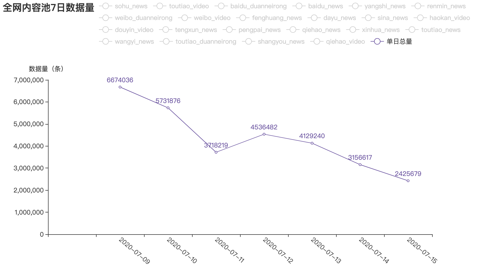

### 需求说明

~~~ 
统计抓取各个网站的日增数据量近一周

生成折线图，搭建接口，访问，以及每日推送到指定的关注人员邮箱
~~~

### 使用说明
#### 1.运行times_search_data.py

~~~
每日定时生成折线图的html文件，csv文件，并且推送监测接口，到邮箱
~~~

#### 2.开启server.py 接口服务

~~~
运行server.py开始测试使用
~~~

#### 3. 服务端口测试链接

~~~
http://127.0.0.1:7881/data_report/
~~~

### 效果展示

